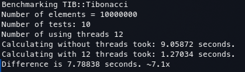
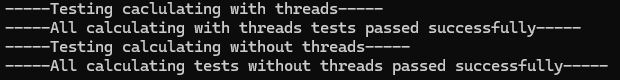
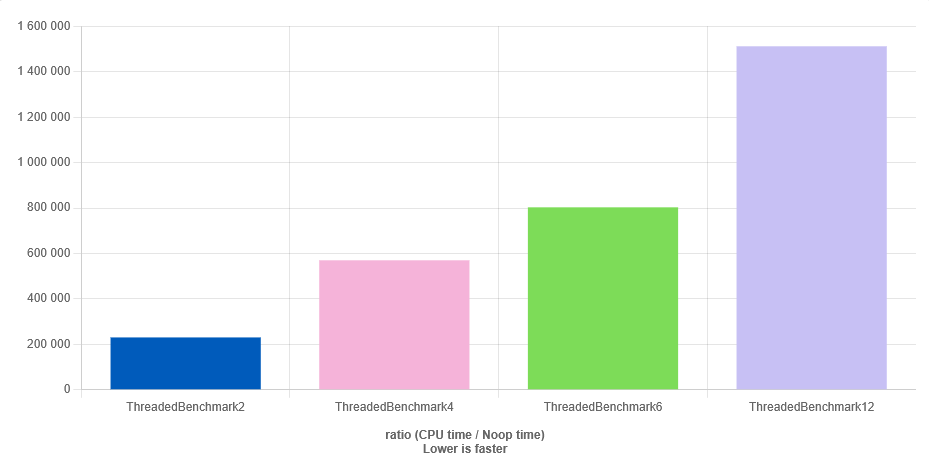

# Tibonacci

A high-performance C++ library for calculating Fibonacci numbers using multithreading.


## Building

The building is pretty simple, you should just clone or download this repo and build with CMake:

```shell
cmake -B build
cmake --build build
```

And you can run the program with ``` --help ``` to see all avalible parameters.

## Tests

This project includes a *tests* directory containing custom test implementations to verify the correctness of Fibonacci number calculations. The test suite consists of two main components: benchmarking tests and accuracy validation tests.

For example on my machine benchmark looks like this:



And calculating tests:



But the results are not accurate enough because its running on my local machine. 

To get more accurate result and to see all the size of performance we can use [C++ Quick Bench](https://quick-bench.com/) a standardized benchmarking platform. Our tests reveal interesting scaling characteristics and we will get more accurate results:


[Link to this result](https://quick-bench.com/q/jEQSnz-rYozZ7mioEtzok_5J310)


The Quick Bench results clearly demonstrate how computational performance scales with additional threads.

> P.S Fibonacci + Threads = Tibonacci
